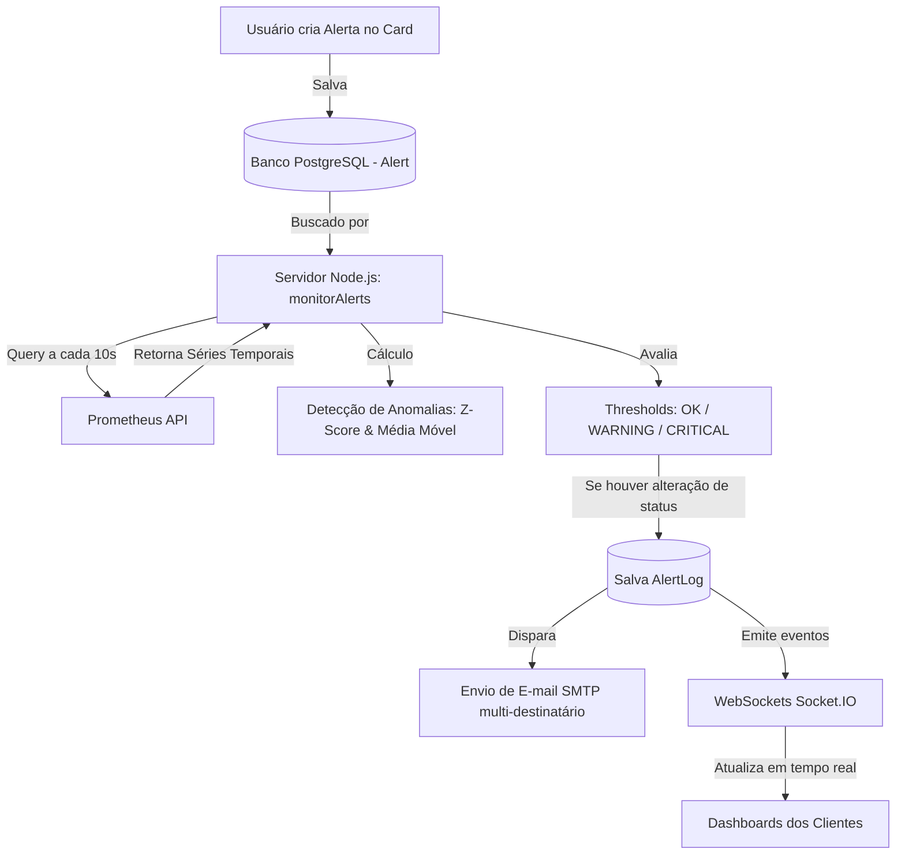

# 📈 Temporal Series - Plataforma de Observabilidade e Monitoramento de Séries Temporais


**Temporal Series** é uma solução completa de observabilidade e monitoramento em tempo real de infraestrutura e serviços. A plataforma se conecta ao **Prometheus** para coletar métricas de sistemas (suportando ambientes **Windows** e **Linux**), fornecendo dashboards interativos personalizáveis, análise preditiva de tendências, detecção estatística de anomalias (z-score e média móvel) e um **serviço background desacoplado de alertas por e-mail** com suporte a múltiplos destinatários.

---

##  Principais Funcionalidades

- 📊 **Dashboards Dinâmicos e Interativos**:
  - Geração de gráficos sob demanda utilizando a biblioteca **Apache ECharts**.
  - Suporte a múltiplos tipos de visualização: **Linhas, Barras, Área, Pontos, Medidor (Gauge), Pizza e Indicadores Stat**.
  - Janelas temporais ajustáveis em tempo real: **5m, 1h, 3h, 12h e 24h**.
  - Ferramenta de comparação com intervalos anteriores (Time Travel / Compare Previous).

- 💻 **Métricas Nativas para Windows e Linux**:
  - **Uso de CPU (%)**: `windows_cpu_time_total` (Windows) / `node_cpu_seconds_total` (Linux).
  - **Uso de Memória RAM (%)**: `windows_memory_physical_free_bytes` / `node_memory_MemAvailable_bytes`.
  - **Uso de Disco (%)**: `windows_logical_disk_free_bytes` / `node_filesystem_free_bytes`.
  - **Tráfego de Rede RX/TX (B/s)**: `windows_net_bytes_received_total` / `node_network_receive_bytes_total`.
  - **Fila do Processador / System Load**: Adaptado nativamente para Windows via `windows_system_processor_queue_length` (Instantâneo e Média de 5 minutos).

-  **Serviço de Monitoramento Desacoplado (Background Engine)**:
  - O motor de monitoramento de alertas roda de forma contínua no servidor Node.js (`monitorAlerts()`), **100% independente da sessão de usuários logados** ou de chamadas de rotas HTTP.
  - Execução periódica a cada 10 segundos buscando todos os alertas ativos no banco de dados.

-  **Detecção Inteligente de Anomalias Estatísticas**:
  - Cálculo contínuo de **Z-Score**, **Média Móvel** e **Tendência de Variação**.
  - Identificação de picos ou desvios fora do padrão histórico mesmo que os limites fixos de threshold não tenham sido ultrapassados.

-  **Notificações por E-mail (SMTP) Multi-Destinatário**:
  - Configuração de limites de **Atenção (WARNING)** e **Alerta (CRITICAL)** diretamente nos cards.
  - **E-mail Padrão Automático**: O e-mail do usuário logado é preenchido como padrão no formulário.
  - **Múltiplos Destinatários**: Permite incluir vários e-mails de notificação separados por vírgula (ex: `dev@empresa.com, ti@empresa.com`).
  - As credenciais SMTP (`SMTP_HOST`, `SMTP_USER`, `SMTP_PASS`) funcionam estritamente como remetente.

-  **Remoção Síncrona e Limpeza Imediata**:
  - Ao remover um dashboard card, seus limites (thresholds), alertas ativos e análises de tendência associados são **destruídos imediatamente** no banco de dados e removidos da interface sem resíduos.

-  **Temas Visualmente Aprimorados (Dark & High-Contrast Light)**:
  - Alternância entre Dark Mode moderno e Light Mode de alto contraste, garantindo leitura perfeita de textos, seletores, botões e opções.

---

##  Arquitetura do Sistema e Fluxo de Alertas



---

##  Tecnologias Utilizadas

### Backend
- **Node.js** com **Express.js** (Servidor Web & API RESTful)
- **Sequelize ORM** (Integração com banco de dados relacional)
- **PostgreSQL** (Armazenamento de usuários, dashboards, alertas e logs)
- **Socket.IO** (Comunicação bidirecional em tempo real)
- **Nodemailer** (Envio automatizado de notificações SMTP)
- **Bcrypt.js** (Criptografia de senhas)
- **Prom-client** (Exportador de métricas do próprio serviço)

### Frontend
- **Express Handlebars** (Templating engine)
- **Apache ECharts** (Renderização gráfica de alto desempenho)
- **Vanilla CSS3 & HTML5** (Design responsivo com tokens HSL e CSS Variables)
- **Page Transitions & Socket.IO Client** (Navegação fluida sem reload completo)

---

##  Estrutura de Arquivos

```
aplication/
├── models/                  # Modelos de Dados (Sequelize)
│   ├── db.js               # Conexão com o PostgreSQL
│   ├── post.js             # Modelo de Usuários (User)
│   ├── alert.js            # Modelo de Alertas e Thresholds
│   ├── alertLog.js         # Modelo de Histórico de Logs de Alertas
│   └── dashboard.js        # Modelo de Dashboards salvos
├── views/                   # Templates Handlebars
│   ├── layouts/
│   │   ├── dashboard.handlebars  # Layout principal do Dashboard com CSS e JS embarcados
│   │   ├── main.handlebars       # Layout da landing page
│   │   ├── login.handlebars      # Tela de login
│   │   └── register.handlebars   # Tela de cadastro
│   ├── dashboard.handlebars      # View simples do dashboard
│   ├── main.handlebars           # View principal
│   └── public/                   # Arquivos estáticos (CSS, JS, Imagens)
├── indexprom.js             # Ponto de entrada da aplicação (Express, Socket.IO, monitorAlerts)
├── package.json             # Dependências e scripts do Node.js
└── README.md                # Documentação técnica do projeto
```

---

## ⚙️ Configuração de Variáveis de Ambiente (`.env`)

Crie um arquivo `.env` na raiz do projeto contendo as seguintes configurações:

```env
# Servidor Express
PORT=3000
SESSION_SECRET=sua_chave_secreta_aqui

# Banco de Dados PostgreSQL
DB_HOST=localhost
DB_PORT=5432
DB_NAME=prom_ts
DB_USER=postgres
DB_PASS=suasenha

# Prometheus
PROMETHEUS_URL=http://prometheus:9090

# Serviço de E-mail SMTP (Remetente)
SMTP_HOST=smtp.gmail.com
SMTP_PORT=587
SMTP_USER=seu-email@gmail.com
SMTP_PASS=sua-senha-de-app
ALERT_FROM="Temporal Series Monitoramento <seu-email@gmail.com>"
SMTP_SECURE=false
SMTP_REJECT_UNAUTHORIZED=false

# Google OAuth (Opcional)
GOOGLE_CLIENT_ID=seu_client_id_google
GOOGLE_CLIENT_SECRET=seu_client_secret_google
GOOGLE_CALLBACK_URL=http://localhost:3000/auth/google/callback
```

---

## 🚀 Como Executar o Projeto

### Pré-requisitos
1. **Node.js** (versão 18.x ou superior).
2. **PostgreSQL** em execução.
3. **Prometheus** em execução e coletando dados de um `windows_exporter` ou `node_exporter`.

### Passo a Passo

1. **Clonar o Repositório e Instalar Dependências**:
   ```bash
   cd aplication
   npm install
   ```

2. **Verificar Sintaxe e Estrutura**:
   ```bash
   node --check indexprom.js
   ```

3. **Iniciar a Aplicação**:
   ```bash
   npm start
   # ou
   node indexprom.js
   ```

4. **Acessar no Navegador**:
   Abra [http://localhost:3000](http://localhost:3000) para visualizar a aplicação.

---

## 📖 Guia de Uso

### 1. Autenticação de Usuário
- **Cadastro**: Acesse `/register`, informe seu e-mail (estrutura válida `usuario@dominio.com`) e crie uma senha de no mínimo 8 caracteres.
- **Login**: Informe o e-mail e a senha cadastrados. O sistema indicará se o e-mail não estiver cadastrado ou se a senha estiver incorreta.

### 2. Adicionar Dashboards e Métricas
- Na tela principal do Dashboard, clique no menu de métricas ou digite uma query PromQL personalizada no construtor.
- Clique em **"Criar gráficos selecionados"**.
- Alterne o tipo de gráfico (Linhas, Barras, Área, Gauge, Pizza) ou ajuste a agregação (Média, Soma, Mínimo, Máximo) em tempo real.

### 3. Configurar Limites de Atenção, Alertas e E-mails
- Em qualquer card de gráfico, clique no botão **`!`** para expandir a configuração de threshold.
- Defina o **Limite de Atenção** (Ex: `60`) e o **Limite de Alerta** (Ex: `80`).
- O e-mail do usuário logado é inserido automaticamente no campo de e-mails. Caso queira notificar outros integrantes da equipe, insira os e-mails separados por vírgula.
- Clique em **"Salvar limites e e-mails"**.

### 4. Monitoramento e Histórico de Alertas
- Quando a métrica ultrapassa os limites ou apresenta anomalia estatística, o status muda automaticamente no topo para `WARNING` ou `CRITICAL`.
- O log é gravado na aba **"Historico / Logs de Alertas"** e o e-mail de notificação é enviado com relatórios e recomendações operacionais.

---

## 🛡️ Licença

Este projeto é disponibilizado sob a licença **MIT**. Veja o arquivo `LICENSE` para mais detalhes.
